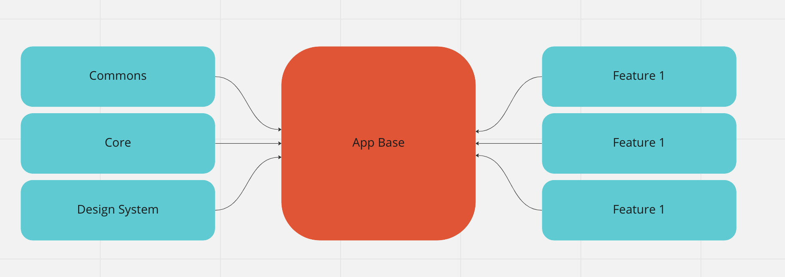
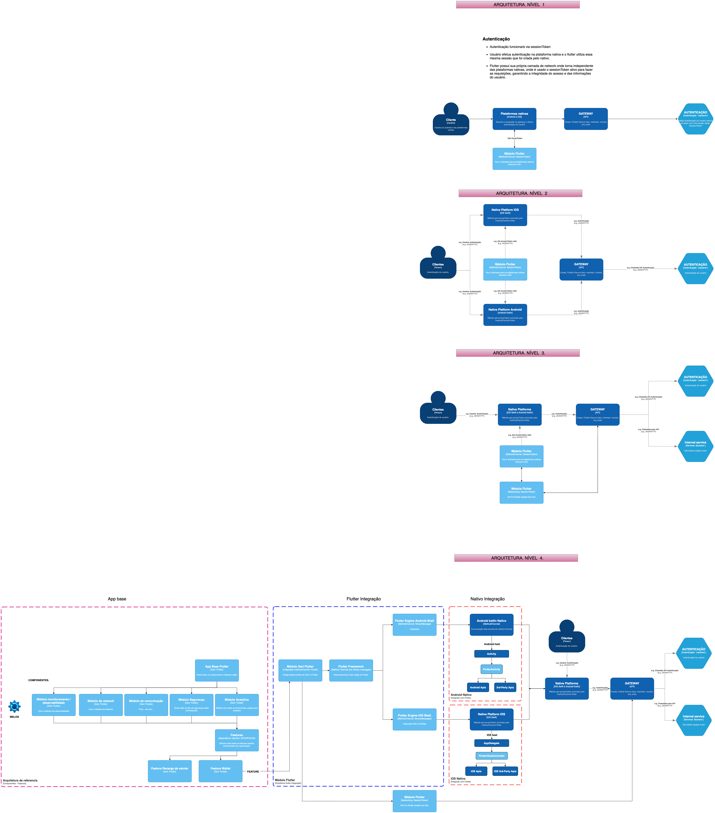

# ARCHITECTURE

The project, as listed below, works with features separate from the base application, composing an architecture similar to a microfrontend based on modules.

<br>



<br>
<br>

---
# ADRs layers


<br>
<br>
---

# 1 Module

Each feature must be a module, so it will contain all the codes related to the execution of the required business rule.

A module should avoid depending on modules other than `shared modules`, but some volatilities should be considered thus allowing the coupling of other modules in the current feature.

<br>

## 1.1 Shared Modules

Some actions are global and must be added in modules that expect shared actions among all modules, they are: `CommonModule`, `CoreModule` and `Design System`.

<br>

### **1.1.1 CommonModule**

All the codes that are common between modules like exporting packages, small implementations and/or responsible for the structure of each module must be added in `CommonModule`.

<br>

### **1.1.2 CoreModule**

This module must contain globally usable interfaces and safe, static implementations.<br>
Prefer to export interfaces instead of implementations for features.

<br>

### **1.1.3 Internationalization**

The aplication must contain the following code:

```dart
supportedLocales: const [
        Locale('pt', 'BR'),
      ],
      localizationsDelegates: const [
        LocalizationsApp.delegate,
        GlobalMaterialLocalizations.delegate,
        GlobalWidgetsLocalizations.delegate,
      ],
      localeResolutionCallback: (locale, supportedLocale) {
        return locale == null
            ? supportedLocale.first
            : supportedLocale.firstWhere(
                (e) =>
                    e.languageCode == locale.languageCode &&
                    e.countryCode == locale.countryCode,
                orElse: () => supportedLocale.first,
              );
      }
```

Every sentence must be inserted in the asset file of the available languages json files, located on: ```assets/lang``` usyng a simple key and the complete phrase, and must be added in correct alphabetical order, as follow:

 ```json
 "welcome": "Bem Vindo!"
 ```

To translate a string, use ```dart TranslateApp(context).text('welcome');
<br>

The extension [Sort JSON objects](https://marketplace.visualstudio.com/items?itemName=richie5um2.vscode-sort-json) can be used to sort the file alphabeticaly

<br>

### **1.1.3 Design System**

Design System name: **sicoob_ds** (TBD)

<br>

### 1.1.3.1 How to add components/widgets

When creating new components one must evaluate which of them already exist, because they must not be repeated. Prefer modifying or adding something to an existing component instead, if it is the case.

Components are only allowed to be created outside the DS (Design Sytem) when they are local to an specific module. If the component needs to be used in another place, it must be created as a DS component.

All components/widgets must have widget tests.

As mentioned later, themes and customization of widgets and components must be inherited to make the widget/component dynamic. Themes must not be created directly on the component/widget. If you need to modify a theme property to make it specific for a desired component, it must be inherited from the main theme and you must use **`copyWith`** to modify the desired property. Avoid loose properties and magic numbers in widgets.

To ensure component/widget responsiveness, avoid adding magic numbers directly to the widget. Instead create a variable when necessary, to add a value that is not a part of the widget, following best practices. This variable should be externalized, since it is the parent widget that must indicate the desired value. By doing this the value described in the component becomes its property. Keep in mind that not all values need to be mandatory or nullable. Always evaluate if the property to be created is really necessary for the widget to function.

When creating components/widgets, it is the parent component/widget's the responsability for any property that involves executing a function, modifying size, theme, prefix, suffix, etc. Also, the parent widget is the one that will indicate what these values are. An example of what has been explained so far is as follows:

```dart
import 'package:flutter/material.dart';

class SicoobIconButton extends StatelessWidget {
  final Function()? onPressed;
  final Widget icon;
  final double radius;

  const SicoobIconButton({
    super.key,
    required this.onPressed,
    required this.icon,
    required this.radius,
  });

  @override
  Widget build(BuildContext context) {
    final theme = Theme.of(context);

    return ElevatedButton(
      onPressed: onPressed,
      style: theme.elevatedButtonTheme.style!.copyWith(
        shape: MaterialStateProperty.resolveWith(
          (states) => RoundedRectangleBorder(
            borderRadius: BorderRadiusDirectional.circular(radius),
          ),
        ),
      ),
      child: icon,
    );
  }
}
```

In text widgets, the string value must be received by the constructor, following what has been proposed so far.

The DTO (Data Transfer Object) that needs to be created must be specific to the component created. Do not use generic DTOs in the application.

There must be a widget book where able to provide a preview of the components/widgets that exist in the DS. Components created without being listed in the component book will not be accepted. This way, it is ensured a good visual documentation of each component/widget.

A Widget's paddings and alignments made for it to fit on a screen should be done outside the component. The cases where padding, alignments, and constraints are worked inside the component occur when the widget is being used within the component and is part of its hierarchy.

When naming components, the following structure must be used:  Start with a prefix related to the company, followed by the name of the widget/component, and end it with a suffix indicating what kind of widget/component it is. For example, **_SicoobIconButton._**

<br>

### 1.1.3.2 How colors should be handled

To work with colors, there will be a class containing all the colors proposed in the Figma project, following the proposed design system. The color class cannot be used outside the main project to add colors. In addition, any colors that need to be used must come by inheritance from the theme. If there is a need to change the color, it must be done within the design system, working with the inheritance of colors, and if it is a new color, it must be added to the current color scheme of the project. Below is an example of how colors should be handled:

```dart
part of 'themes.dart';

class _SicoobThemeColors {
  static const Color sicoobGreen = Color(0xff9BD900);
  static const Color sicoobCyan = Color(0xff16C1F5);
  static const Color sicoobCyanLight = Color(0xffDCF7FF);
  static const Color sicoobDarkBlue = Color(0xff123382);
  static const Color sicoobLightBlue = Color(0xffCFDAF0);
  static const Color sicoobBlue = Color(0xff004BC1);
  static const Color sicoobPurple = Color(0xff6531BD);
  static const Color sicoobPink = Color(0xffF660A3);
  static const Color sicoobRed = Color(0xffFF3C3C);
  static const Color sicoobBlack = Color(0xff1F1F1F);
  static const Color sicoobDarkGrey = Color(0xff666666);
  static const Color sicoobGrey = Color(0xffD1D1D1);
  static const Color sicoobLightGrey = Color(0xffF0F0F0);
  static const Color sicoobWhite = Color(0xffFDFDFD);
  static const Color sicoobErro = Color(0xffCC1100);
  static const Color sicoobSuccess = Color(0xff9BD900);
}

const sicoobColorSCheme = ColorScheme(
  brightness: Brightness.light,
  primary: _SicoobThemeColors.sicoobBlue,
  onPrimary: _SicoobThemeColors.sicoobWhite,
  secondary: _SicoobThemeColors.sicoobPurple,
  onSecondary: _SicoobThemeColors.sicoobWhite,
  error: _SicoobThemeColors.sicoobErro,
  onError: _SicoobThemeColors.sicoobErro,
  background: _SicoobThemeColors.sicoobWhite,
  onBackground: _SicoobThemeColors.sicoobBlack,
  surface: _SicoobThemeColors.sicoobWhite,
  onSurface: _SicoobThemeColors.sicoobBlack,
);
```

The architectural limit must be strictly followed so that we do not have future problems with the wrong colors being added and used.

<br>

### 1.1.3.3 How themes should be handled

To have the option of a dynamic theme, we will work with Flutter's ThemeData, which describes the themes of the widgets that will be used, from a buttonTheme to a TextTheme, and where by default we have the light theme.

To create themes, we have a class called themes, where we will have the themes. If a theme needs to be created for a widget or a property needs to be modified, it must be done in the themes dart file.

- [Theme Flutter doc](https://api.flutter.dev/flutter/material/Theme-class.html)

```dart
import 'package:flutter/material.dart';

part 'sicoob_theme_colors.dart';

ThemeData get lightTheme => ThemeData(
      colorScheme: sicoobColorSCheme,
      elevatedButtonTheme: elevatedButtonTheme,
    );

ThemeData get darkTheme => ThemeData.dark();

ElevatedButtonThemeData get elevatedButtonTheme => ElevatedButtonThemeData(
      style: ButtonStyle(
        foregroundColor: MaterialStateProperty.resolveWith((states) {
          if (states.contains(MaterialState.disabled)) {
            return _SicoobThemeColors.sicoobWhite;
          }
          return _SicoobThemeColors.sicoobWhite;
        }),
        backgroundColor: MaterialStateProperty.resolveWith(
          (states) {
            if (states.contains(MaterialState.pressed)) {
              return _SicoobThemeColors.sicoobDarkBlue;
            } else if (states.contains(MaterialState.disabled)) {
              return _SicoobThemeColors.sicoobLightBlue;
            }

            return _SicoobThemeColors.sicoobBlue;
          },
        ),
        shape: MaterialStateProperty.resolveWith((states) {
          return RoundedRectangleBorder(
            borderRadius: BorderRadius.circular(20),
          );
        }),
      ),
    );
```

<br>

### 1.1.3.4 How assets should be worked on

Following best practices, we must put the path of the assets in the main yaml file of the project. To add the assets, a widget must be created for the desired asset. The path of the assets should be added to a constant class for assets. By creating widgets for the assets, we will have an easier time using them, since the use of widgets facilitates screen creation.

To work in a way that the size of the app is not influenced by the assets being used, we need to work with the links of the cdn created for the application. A pre-cache of these assets that will come from outside, such as images and illustrations, must be done. Assets that are considered heavy for the application (images and illustrations) cannot be added to the assets locally; they must come from a cdn service.

Assets for fonts, internationalization, etc. Must be added to the design system to facilitate their use and implementation.

Classes with constant text values in the main project will not be accepted. They need to come from the design system so that those values are centralized in one place, which will be the app's internationalization file.

<br>

### 1.1.3.5 Animations

To work with external animations, we must use the Lottie package to create them. The animations must be created as separated widgets/components, an example of that is a loading animation that could be created as a LoadingWidget. This must be followed so we can have easy imports and workflow with the animations.

For each animation created, we recommend using the **[SingleTickerProviderStateMixin](https://api.flutter.dev/flutter/widgets/SingleTickerProviderStateMixin-mixin.html)** as it is more efficient. It is best to avoid using the **[TickerProviderStateMixin](https://api.flutter.dev/flutter/widgets/TickerProviderStateMixin-mixin.html)** whenever possible. The **[TickerProviderStateMixin](https://api.flutter.dev/flutter/widgets/TickerProviderStateMixin-mixin.html)** is only necessary when we have multiple animations that are played at the same time.

Properties that need to be created for an animation must be externalized so the parent can dictate their values. Please follow the section on **How to Add Components/Widgets** where you can learn how to create your animation widget. Except animation controllers, those must be externalized in the widget structure.

<br>

## 1.2 Module Schema

Folders must follow the "Clean Architecture" pattern.

```
.
└── module/
    ├── data/
    │   ├── datasources
    │   ├── repositories
    │   ├── services
    │   ├── stores
    │   └── reducers
    ├── domain/
    │   ├── entities
    │   ├── repositories
    │   ├── services
    │   └── usecases
    └── ui/
        ├── pages
        └── widgets
```

**DOMAIN**: Layer responsible for all the feature's main code.
Business rule representation and execution.<br>
**DATA**: Layer responsible for adapting external data to the domain.<br>
**UI**: Responsible for visual user codes.

<br>

---

# 2 Limits and rules

Points to consider before introducing a new feature:

- Every project will need to respect the Lint rules written in the flutterando-analysis package.
- This project must have a minimum test coverage of at least 70%.
- Each feature must contain implementations referring to the feature.
- All design patterns used in the project must be listed in the “Design Patterns” section of this document, otherwise they will be considered erroneous implementations.
- New packages and plugins can only be used in projects after evaluation and approval by the entire team responsible for the project. If approved, the package then must be added to `CommomModule`.
- It is not allowed to have a concrete class as a dependency of a layer. Cohesion will only be accepted with abstract classes or interfaces. With the exception of `Store`, `Pages` and `Widget`.
- Each layer should have only one responsibility, i.e. one reason to change.

<br>

<br>

---

# 3 Design Pattern

Here are listed all the standards and the situations in which they can be applied.

<br>

## 3.1 External API Access (REST)

`Repository Pattern` with `Datasource`.<br>
[Repository Documentation form Microsoft](https://learn.microsoft.com/en-us/dotnet/architecture/microservices/microservice-ddd-cqrs-patterns/infrastructure-persistence-layer-design)

<br>

## 3.2 Isolate Layers

The `Service` pattern will be used for code types that don't have a predefined pattern but need to be separated.

[Service layer pattern documentation](https://en.wikipedia.org/wiki/Service_layer_pattern)

<br>

## 3.3 Dependency Injection

Necessary to apply the Dependency Inversion Principle (DIP).

[Fluttering Video - Dependency Injection](https://www.youtube.com/watch?v=KpPnDHpgHnA)

<br>

## 3.4 State Management

For state management it was selected the [Segmented State Pattern](https://triple.flutterando.com.br/docs/intro)

See also **6 State management**

<br>

## 3.5 Adaptation and conversion

Data types conversion should be made using the `Adapter` pattern.<br>

[Adapter Pattern documentation](https://refactoring.guru/design-patterns/adapter)

<br>

## 3.6 Delegate responsibilities to other layers

Usually some responsibilities can transcend layers. To avoid this, we will use the `Result` pattern, which is a kind of two-valued tuple, making the error handling responsibility stay in it's designated layer (eg Repository).

[Result Documentation](https://pub.dev/packages/result_dart)

<br>

<br>

---

# 4 Nomenclature

Both the [Dart Style Guide](https://dart.dev/guides/language/effective-dart/style) and [Effective Dart Design](https://dart.dev/guides/language/effective-dart) will be adopted as the design references for naming the interface, class, method, and variable in the project.

In addition to the rules defined above, we add:

- Objects will be named preferably in English;

- Use only ASCII characters, never graphic characters and/or emoji in the names;

- Proprietary names that do not exist in English, or have a specific name for the business, such as **CPF**, **Boleto**, must not be translated;

> "There are only two hard things in Computer Science: caching invalidation and naming things." [Phil Karlton](https://www.karlton.org/2017/12/naming-things-hard/)

When in doubt about how to apply the rules defined here, seek consensus among the team's developers and update the documentation, but always consider that the main objective is to avoid "noise" in the identification.

<br>

## 4.1 Interfaces

It is essential to start from the principle that the construction of the interface is born from the need of those who are going to consume it, and not of those who are going to implement it. The name of the interface needs to clearly identify the objective and the context of who is consuming it.

Not using prefixes and suffixes just to identify that an interface is consuming, is an anti-pattern to be avoided. The consumer needs the implementation, it doesn't matter if he is currently consuming a contract.

<br>

## 4.2 Anti-patterns

In this project the following practices are considered as anti-patterns.

- Use of the C# interface identification pattern using the `I` prefix. This is a dotNet environment convention that does not make sense for the Dart environment.

```dart
abstract class IShowUsersUseCase { }
```

- Using the `Protocol` suffix is a bad habit in the Swift world that will not be adopted in this project.

```dart
abstract class ShowUsersUseCaseProtocol { }
```

- The `Contract` suffix has been used in some important Dart community packages. This approach, in addition to continuing to representing a [code smell](https://en.wikipedia.org/wiki/Code_smell), will also collide with a real business need when it is necessary to represent an object of the contract type.

```dart
abstract class ShowUsersUseCaseContract { }
```

We must avoid any attempt to identify an interface, just as it is not a habit to create a class with some kind of identification that it is a class.

<br>

## 4.3 Recommended

When the interface represents a **capacity**/**ability** the suffix **able**, **ible**, or **ing** must be used.

```dart
abstract class Equatable { }

abstract class Disposable { }

abstract class Tracking { }

abstract class RemoteConfiguring { }
```

When a **concrete behavior** is represented, you must use the concrete name.

**BAD**

```dart
abstract class IApiDataSource { }

abstract class ApiContractDataSource { }

abstract class ApiDataSourceProtocol { }
```

**GOOD**

```dart
abstract class ApiDataSource { }
```

It is clear that the objective is to consume the **API** data source, the implementation is not the responsibility of the consumer.

<br>

## 4.4 Concrete class

The naming of the concrete class needs to make clear what is the purpose of the existence of that code, and the use of prefixes or suffixes that bring noise in the identification must be avoided.

Classes that are implementations of an interface must **not** use the **Impl** prefix.

**BAD**

```dart
// Implementation of the inappropriately named interface
class ApiDataSourceImpl implements ApiDataSource { }

class ApiDataSourceExtend extends ApiDataSource { }
```

**GOOD**

```dart
// Interface implementation with proper name
class RestApiDataSource implements ApiDataSource { }

class GraphQlApiDataSource extends ApiDataSource { }
```

In the example above, it is clear that one implementation of `ApiDataSource` will use a REST strategy through the HTTP protocol and another will use GraphQL.

If the code of `RestApiDataSource`, for example, is being used on another approach besides what is suggested in the class' name, we have an invalid implementation and the code will be rejected in the _code review_ process.

<br>

## 4.4 Pattern suffix

Adding the pattern suffix (**Repository**, **UseCase**, **DataSource**, **Factory**) is a good practice to inform the purpose and the behavior of an object and also who can consume it.

Using **Clean Architecture** as an example, it is odd if **UseCase** was consuming a **DataSource**.

**GOOD**

```dart
abstract class UserProfileRepository { }

abstract class UserProfileDataSource { }

abstract class UserProfileUseCase { }
```

<br>

## 4.5 Use case (Domain layer)

The use case interface must use the **UseCase** suffix, but the implementation does not need to use this suffix.

**GOOD**

```dart
abstract class UserProfileUseCase { }

class UserProfile implements UserProfileUseCase { }
```

<br>

## 4.6 Graphical interface (Presenter layer)

The **Presenter** screen will be suffixed with **Page**, and a page may or may not be associated with a **Store**.

**BAD**

```dart
class UserProfileScreen extends StatefulWidget { }

class UserProfileViewController extends StatefulWidget { }

class UserProfileActivity extends StatefulWidget { }
```

**GOOD**

```dart
class UserProfilePage extends StatefulWidget { }
```

For presenter components, you must use the suffix **Widget**.

**BAD**

```dart
class UserInputComponent extends StatelessWidget { }

class UserInputView extends StatelessWidget { }
```

**GOOD**

```dart
class UserInputWidget extends StatelessWidget { }
```

<br>

<br>

---

# 5 Packages

## 5.1 Developement packages

<br>

To render Json animations:
`lottie: ^2.2.0`

For HTTP client and API consume:
`uno: ^1.1.4`

For Navigation, and Dependency Injection:
`flutter_modular: ^5.0.3`

Tuple, Functional programming:
`result_dart: ^1.0.5`

Analytics:
`firebase_analytics: ^10.1.4`

SVG render:
`flutter_svg: ^2.0.2`

SnackBars and Modals:
`asuka: ^2.0.2`

Opening Email and external Links:
`url_launcher: ^6.1.10`

Check and request Permissions:
`permission_handler: ^10.2.0`

Maps Rendering Google:
`google_maps_flutter: ^2.2.4`

Maps Rendering Flutter Map:
`flutter_map: ^3.1.0`

Language internationalization:
`flutter_localization: ^0.1.10`

Firebase:
`firebase_core: ^2.7.0`

Auth:
`firebase_auth: ^4.2.9`

Data persistence:
`hive: ^2.2.3`

Remote Config:
`firebase_remote_config: ^3.0.13`

App Review:
`in_app_review: ^2.0.6`

State Management:
`flutter_triple: ^2.0.1`

File Caching:
`flutter_cache_manager: ^3.3.0`

To visualize and share PDF:
`flutter_pdfview: 1.2.9`

Provides latitude and longitude:
`latlong2: ^0.8.1`

Encryption:
`encrypt: 5.0.1`

Open Mail App:
`open_mail_app: 0.4.5`

App Settings:
`app_settings: ^4.2.0`

Webview:
`webview_flutter: ^4.0.7`

App Settings:
`app_settings: ^4.2.0`

In App Purchase:
`in_app_purchase: ^3.1.5`

<br>

## 5.2 Dev Dependencies for testing

For golden Tests:
`golden_toolkit: ^0.13.0`

to mock implementations:
`mocktail: ^0.3.0`

State Management:
`triple_test: ^1.0.0+1`

<br>
<br>

---

# 6 State management

The state must be encapsulated in a _Store_ and must **not have** business logic code execution nor additional behavior prior, during or after storing the actual state and possible actions. A page or widget can react to multiple Stores.

An action is an event that a Reducer can listen to.

In this architecture the state is decoupled from business logic execution as in the following diagram:

```
            .------.
            | Page |
            '------'
               |^
Call Action    ||   Update Page
               ||
               ||
             __v|___
            | Store |
             -------
               |^
  Send Event   ||   Update State
               ||
               ||
            ___v|____
           | Reducer |
            ---------
          Listen Event
```

```
            .------._____Call Action____
            | Page |<----Update Pge----.|
            '------'                   ||
               |^                      ||
Call Action    ||                      ||
               ||                      ||
               ||                      ||
             __v|___                 __|v___
            | Store |               | Store |
             -------                 -------
               |^                      ^|
  Send Event   ||   Update State       ||
               ||                      ||
               ||                      ||
            ___v|____                  ||
           | Reducer |_________________||
            --------- <-----------------'
          Listen Events
```

<br>

## 6.1 State Pattern

In cases of multiple sucessful states the _[State Pattern](https://refactoring.guru/design-patterns/state)_ can be used:

```dart
abstract class UserState {}

class UnregisteredUserState {...}
class RegisteredUserState {...}
```

<br>

## 6.2 Packages

All Stores shall be created using
[triple](https://blog.flutterando.com.br/triple-pattern-um-novo-padr%C3%A3o-para-ger%C3%AAncia-de-estado-no-flutter-2e693a0f4c3e)'s _Store_. For in-depth examples, guides, tutorials and documentation refer to [triple documentation](https://triple.flutterando.com.br/docs/getting-started/what-is-triple) and [triple's store api reference](https://pub.dev/documentation/triple/latest/triple/Store-class.html).

<br>

## 6.3 Naming

A Store must be named after the state it is storing plus the the _Store_ suffix. e.g.: `EnabledProtectionsStore`

<br>

## **6.4 How to create a Store**

When creating a Store a setter must be created if there is a need to change it's stored value.

The package Triple's `update` method must not be called from outside the Store itself.

A Store can also have actions.

```dart
class UserStore extends Store<User>{
  UserStore() : super(UnregisteredUser());

  void setUser(User newUser) => update(newUser);

  final fetchUser = RxNotifier<String>('86fu');
}
```

<br>

## 6.5 Limitations

A _Store_ must inherit Triple's _Store_.

A _Store_ must not contain another _Store_.

A _Store_ cannot contain any business logic.

A _Store_ action must be a `RxNotifier`

<br>
<br>

---

# 7 Version Control

The pattern [conventional commits](https://www.conventionalcommits.org/en/v1.0.0/) was chosen as the basis for the project commits.

Any commit outside this pattern will be considered wrong.

<br>
<br>

---

# 8 Tests

Tests must follow the triple-A pattern (Arrange, Act, Assert).

[Triple-A Article](https://medium.com/@pjbgf/title-testing-code-ocd-and-the-aaa-pattern-df453975ab80)

Example:

```dart
test('should execute a sum correctly', (){

  // arrange
  int number1 = 2;
  int number2 = 1;

  // act
  final result = sumFunction(number1, number2);

  // assert
  expect(result, 3);

});

```

<br>

## 8.1 Test description

The test description must represent the expected result, according to the action performed.
You should _NOT_ use descriptions that are obvious like, for example, when a result of a list is expected to be a List you have to avoid a description as such: "Should return a `List<Product>` object".

<br>

## 8.2 Test group

The groups must be named according to the class name, which may or may not be followed by the method.
At the end of the description, you must add " | " (space, pipe, space).

<br>

Usecase example:

```dart

group('SaveAddressUsecase | ', (){

    // all SaveAddressUsecase`s test

});

```

Repository exemple:

```dart

group('ProductRepository.fetchAll | ', (){

    // all ProductRepository.fetchAll`s test

});
```

<br>

---
